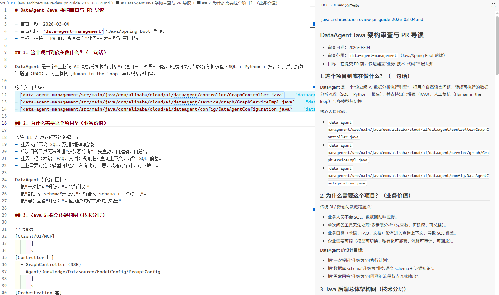
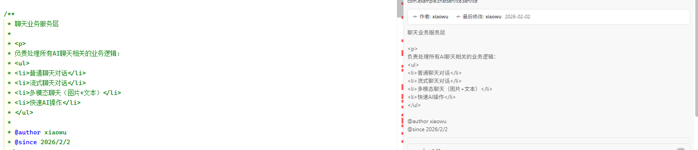
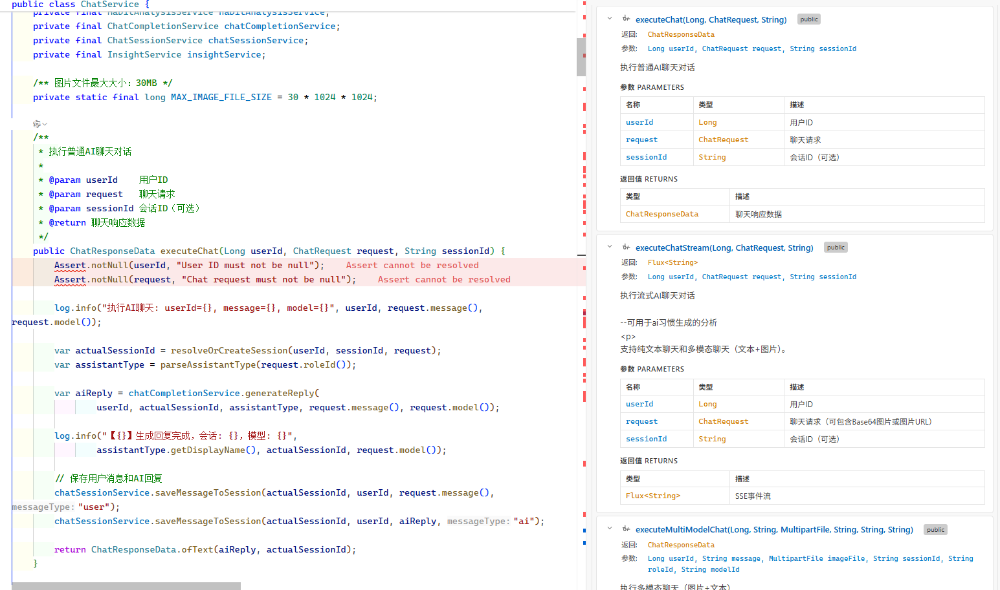

[中文](./README.md) | [English](./README.en.md)

# Doc Sidebar for VS Code

Display code documentation in real time in the VS Code sidebar.
Currently supports Java / TypeScript / JavaScript / Markdown, with bidirectional synchronized navigation.

Marketplace: `comment sidebar`
Author: [dawdadsd](https://github.com/dawdadsd)

## Features

- Click a method/function in the sidebar -> jump to the corresponding location in code
- Move the cursor in code -> the sidebar automatically highlights the current method/function
- Compact mode: quickly browse the member list
- Detailed mode: show complete documentation details
- Return types and parameter types are highlighted
- Tags such as `@param`, `@return`, `@throws` are shown in table format
- Can display Git author and last modified time (based on `git blame` / `git log`)

## Settings

| Setting | Description | Options | Default |
|---|---|---|---|
| `commentSidebar.codePreviewTheme.dark` | Code highlight theme for code preview (Markdown code blocks / comments) when the editor is in a dark theme | `vs2015`, `catppuccin-frappe`, `catppuccin-macchiato`, `catppuccin-mocha` | `vs2015` |
| `commentSidebar.codePreviewTheme.light` | Code highlight theme for code preview when the editor is in a light theme | `github`, `catppuccin-latte` | `github` |

All four [Catppuccin](https://github.com/catppuccin/highlightjs) flavors (Latte / Frappé / Macchiato / Mocha) are bundled. Configure the default preview theme per editor light/dark mode; changes apply immediately.

## Demo Video

- [I developed a VS Code plugin: a Doc plugin for different programming languages](https://www.bilibili.com/video/BV1ZYFHzgERT?vd_source=5cc5b352bbecf64c204775d57aa91764)

## Demo Images

Demo for Markdown docs

Demo for Java code:

showLock: true
The same applies to TS and JS code.

## Environment Requirements (Git Author Info)

When retrieving author/last modified information, this extension directly calls system `git` commands (such as `git blame` / `git log`) and does not rely on any extra VS Code Git extension.

- macOS: Git is usually preinstalled or already available, so author info can be displayed normally.
- Windows: You need to install **Git for Windows** and ensure `git` is in PATH.
  Also, the current file must be inside a valid Git repository (with available `.git` history).

## Usage

1. Open any Java / TypeScript / JavaScript file
2. Click the Doc Sidebar icon in the left activity bar
3. View method/function documentation in the sidebar
4. Click a method/function name to jump to its code location

## System Requirements

- VS Code 1.95.0 or later
- When parsing Java files, installing a Java language support extension is recommended (for better Symbol parsing)

## License

This project is released under the MIT License. See [LICENSE](https://github.com/dawdadsd/Code-comment-visualization-plugin/blob/main/LICENSE) for details.
