针对深色模式，某些东西是黑色的

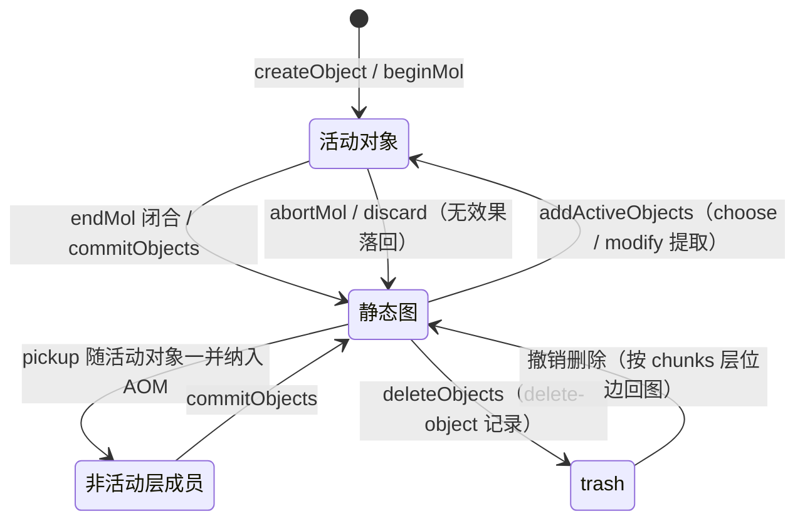
箭头

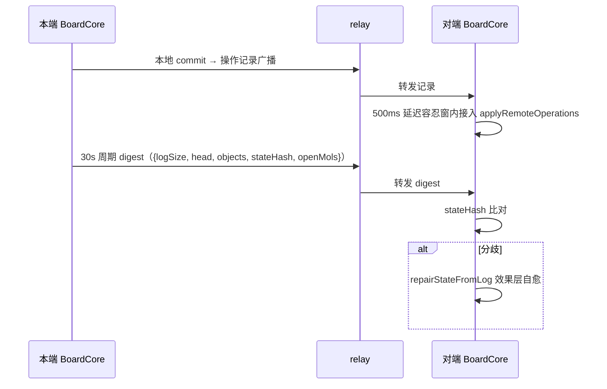
箭头三角形，指针

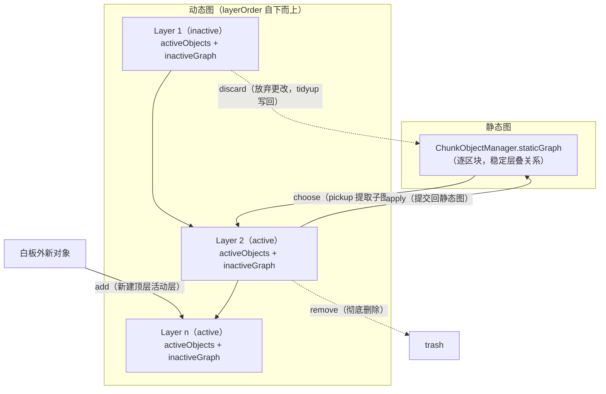
框外文字

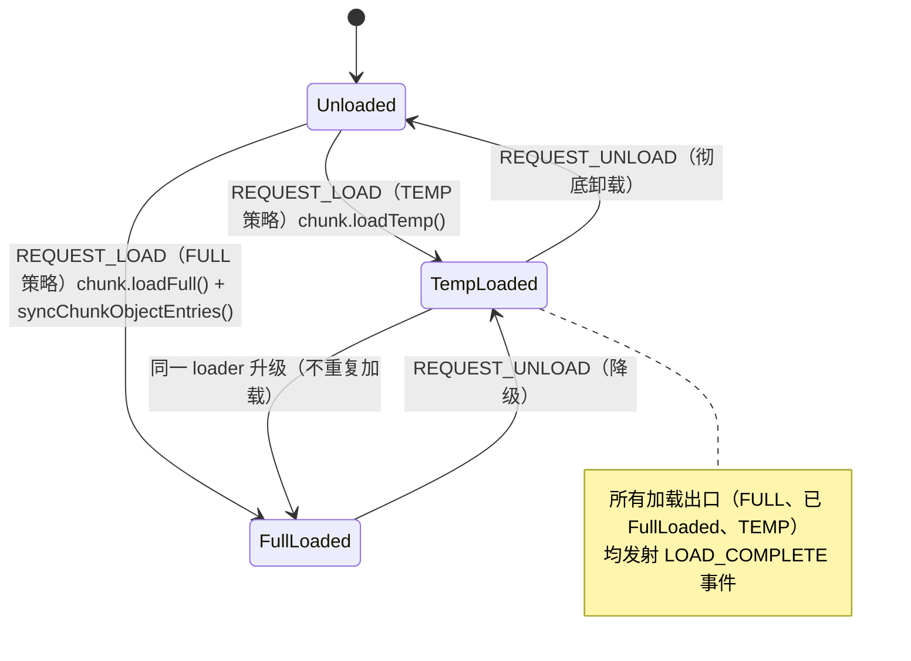
箭头

/Users/frank/Code/HoundTek/hound-whiteboard/src/kernel/board/docs/tier-graph-document.md
会导致插件崩溃

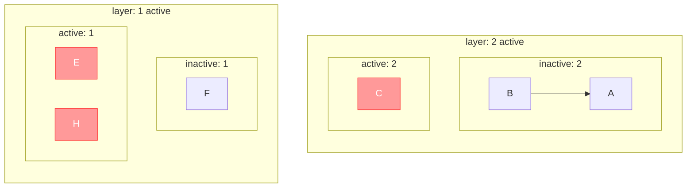


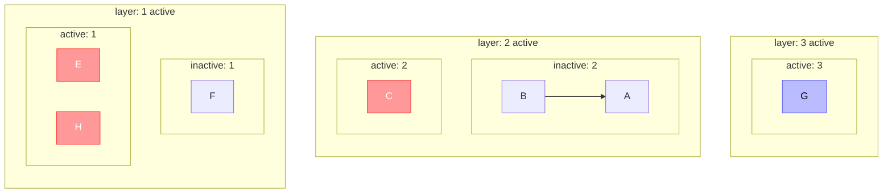

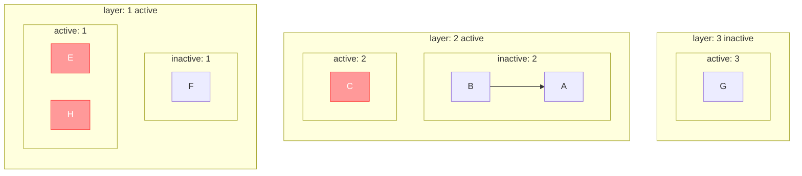


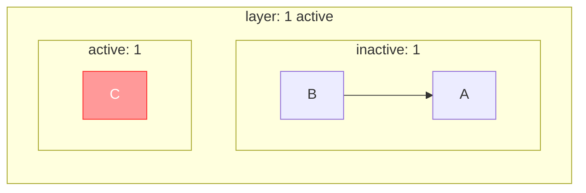

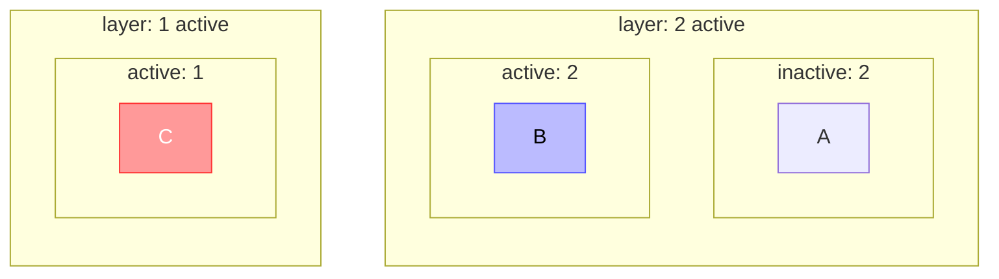

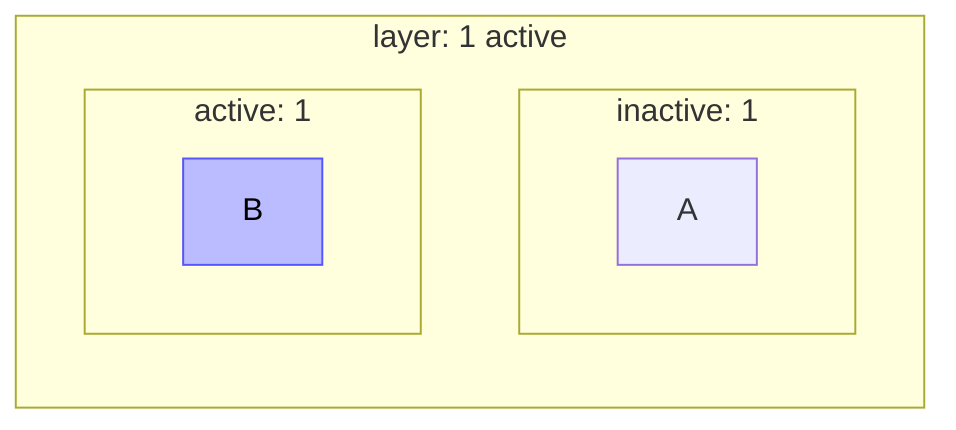


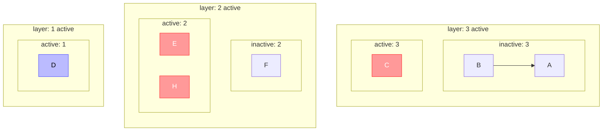
箭头和框外文字

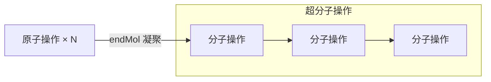
框外文字

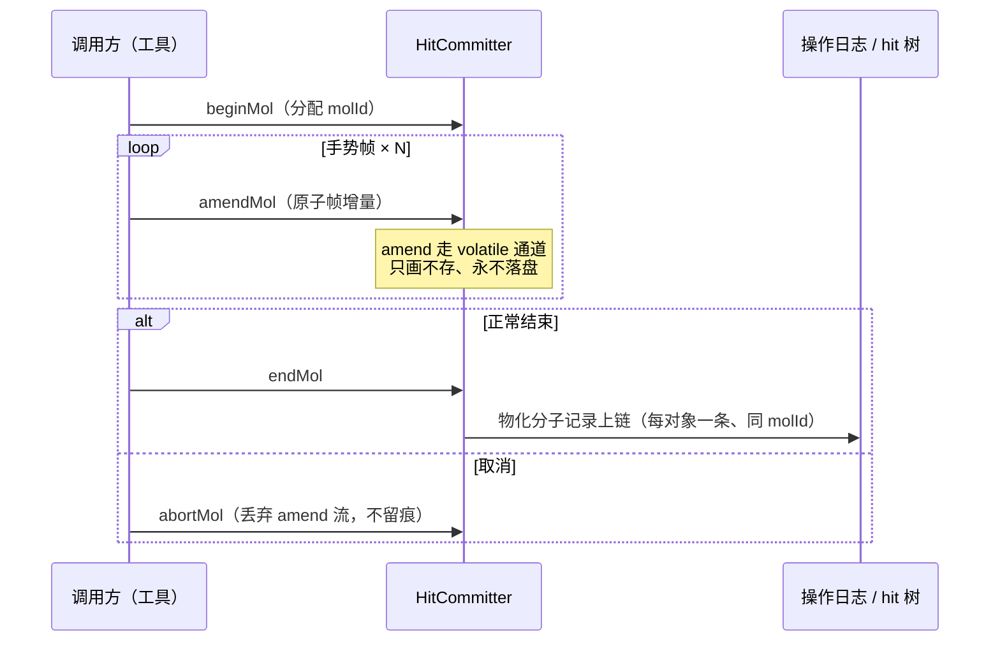
alt 框文字

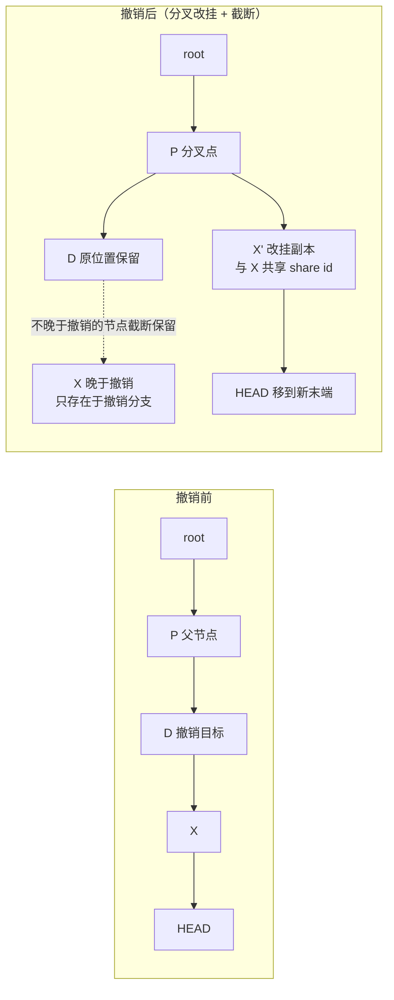
框外文字

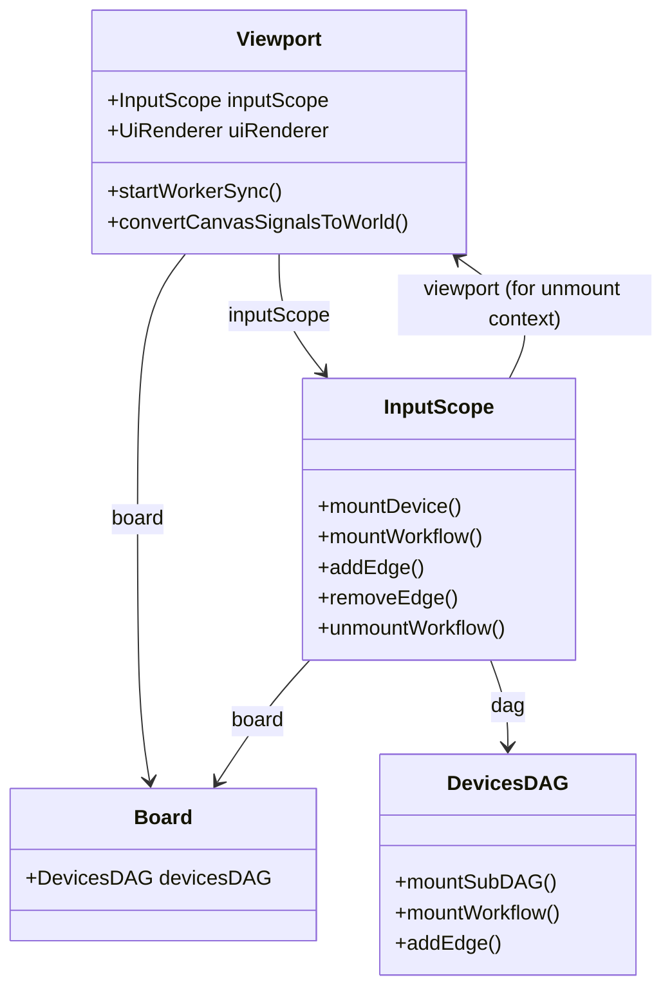
箭头

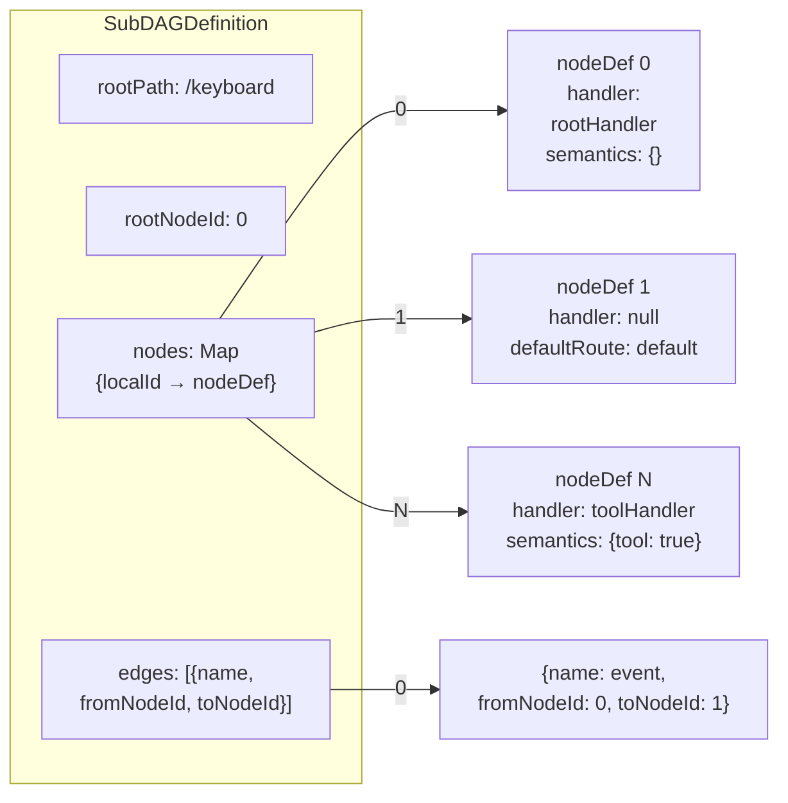
箭头

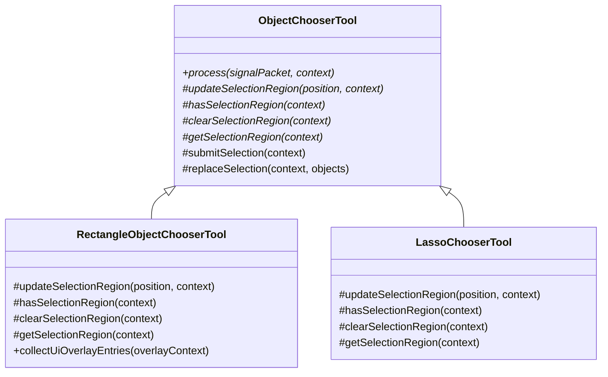
箭头

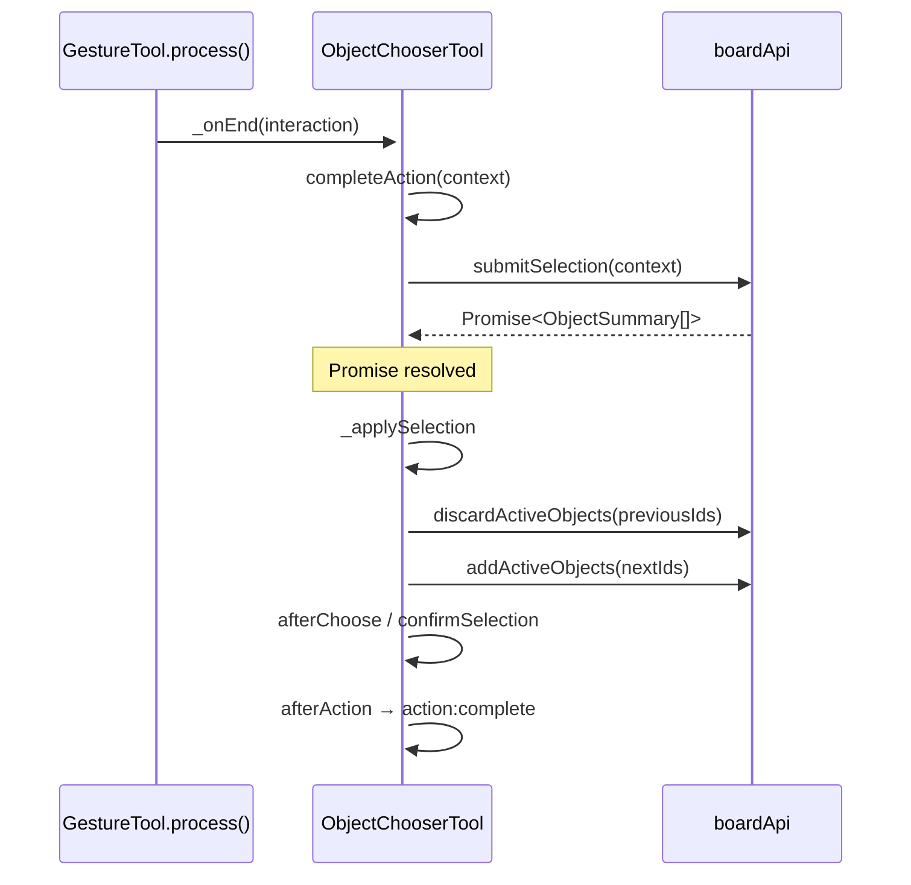
箭头

```mermaid
flowchart LR
    subgraph 父类调度
        P[process]
        F[_finalizeSelection]
        A[_applySelection]
    end

    subgraph 子类 hook
        U[updateSelectionRegion]
        H[hasSelectionRegion]
        C[clearSelectionRegion]
        G[getSelectionRegion]
        O[collectUiOverlayEntries]
    end

    P -->|position| U
    P -->|end + H| F
    F -->|submitSelection →| G
    F --> A
    A --> C
```
框外文字

```mermaid
sequenceDiagram
    participant F as _finalizeSelection
    participant S as submitSelection<br/>（父类默认）
    participant B as boardApi

    F->>S: getSelectionRegion(ctx)
    S->>B: hitTest(worldRect, "intersect")
    B-->>S: objectIds[]
    S->>B: queryObjects(objectIds)
    B-->>S: ObjectSummary[]
    S-->>F: summaries
```
箭头

```mermaid
classDiagram
    class ObjectChooserTool {
      #process(signalPacket, context)
      #_finalizeSelection(context)
      #_applySelection(context, objects)
      #replaceSelection(context, objects)
      #submitSelection(context)
      #updateSelectionRegion(position, context)*
      #hasSelectionRegion(context)*
      #clearSelectionRegion(context)*
      #getSelectionRegion(context)*
    }
    class RectangleObjectChooserTool {
      +createSelectionWorldRect(start, end)
      -resolveSelectionDragState(context)
      -writeSelectionDragState(context, state)
      -clearSelectionDragState(context)
      #updateSelectionRegion(position, context)
      #hasSelectionRegion(context)
      #clearSelectionRegion(context)
      #getSelectionRegion(context)
      +collectUiOverlayEntries(overlayContext)
    }
    ObjectChooserTool <|-- RectangleObjectChooserTool
```
箭头

```mermaid
classDiagram
    class Tool {
        +process(signalPacket, context)
        +on(hookName, listener)
        +umount(context)
        +reset()
    }

    class GestureTool {
        +isGestureActive: boolean
        +autoActionOnGestureEnd: boolean
        +beginGesture(interaction)
        +updateGesture(interaction)
        +completeGesture(interaction)
        +cancelGesture(interaction)
        +beforeAction(context)
        +performAction(context)
        +afterAction(context, result)
        +completeAction(context)
        +discardAction(context)
        +buildInteraction(signalPacket, context)
    }

    class MultiGestureTool {
        +_onEnd(interaction)
        +_onCancel(interaction)
        +_onObjectEnd(interaction)
        +_onObjectCancel(interaction)
    }

    class ObjectCreatorTool {
        +beginGesture(interaction)
        +updateGesture(interaction)
        +completeGesture(interaction)
        +completeAction(context)
    }

    class ObjectChooserTool {
        +beginGesture(interaction)
        +updateGesture(interaction)
        +cancelGesture(interaction)
    }

    class ObjectModifierTool {
        +beforeAction(context)
        +performAction(context)
        +afterAction(context, result)
    }

    Tool <|-- GestureTool
    GestureTool <|-- MultiGestureTool
    GestureTool <|-- ObjectCreatorTool
    GestureTool <|-- ObjectChooserTool
    GestureTool <|-- ObjectModifierTool
```
箭头

```mermaid
classDiagram
    class GestureTool {
        +beginGesture(interaction)
        +updateGesture(interaction)
        +completeGesture(interaction)
        +performAction(context)
    }

    class ObjectEraserTool {
        +eraserSize: number
        #_lastTrailPoint: Vector
        +applyTrailSegment(from, to, interaction)*
    }

    class DataObjectEraserTool {
        +applyTrailSegment(from, to, interaction)
    }

    class TraitObjectEraserTool {
        +applyTrailSegment(from, to, interaction)
    }

    class CompositeObjectEraserTool {
        +applyTrailSegment(from, to, interaction)
    }

    GestureTool <|-- ObjectEraserTool
    ObjectEraserTool <|-- DataObjectEraserTool
    ObjectEraserTool <|-- TraitObjectEraserTool
    ObjectEraserTool <|-- CompositeObjectEraserTool
```
箭头

```mermaid
sequenceDiagram
    participant App as 应用代码
    participant Logger as Logger
    participant LogBus as LogBus
    participant CP as ConsolePrinter
    participant RB as RingBuffer
    participant TB as ThrottledBus

    App->>Logger: .info("started")
    Note over Logger: 级别过滤

    Logger->>LogBus: emit("INFO", entry)
    Note over LogBus: 同步分发

    par 消费者
        LogBus->>CP: handler(entry)
        CP-->>CP: console.log(...)
    and
        LogBus->>RB: push(entry)
        Note over RB: buffer[head] = entry
    and
        LogBus->>TB: write(entry)
        Note over TB: 未满 → 攒批
    end

    Note over TB: 500ms 后或满额
    TB-->>TB: flush()
    TB->>TB: onFlush(batch)
```
箭头和 alt 框文字
